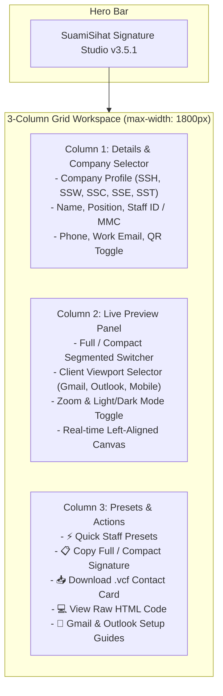

# SuamiSihat Email Signature Studio v3.5.1

[](https://assets.suamisihat.myds.me/)
[](https://assets.suamisihat.myds.me/components/)
[](tests/signature.test.js)
[](https://suamisihat.com.my)

Welcome to the **SuamiSihat Email Signature Studio (v3.5.1)** — an enterprise-grade, browser-based email signature generator built for **SuamiSihat Group of Companies** (SSH, SSW, SSC, SSE, SST). It delivers real-time live previews, full external and compact reply formats, 1-click presets, contact QR codes, vCard downloads, and pixel-perfect client viewports for Gmail and Outlook.

---

## 🚀 Quick Links & Live Application

| Resource | URL & Action |
| :--- | :--- |
| ⚡ **Live Signature Studio** | 👉 [**https://suamisihat.github.io/mail-signature/**](https://suamisihat.github.io/mail-signature/) |
| 🎨 **Design System Tokens** | 📐 [**SuamiSihat Component Library v3.5.1**](https://assets.suamisihat.myds.me/components/) |
| 👁️ **Full Raw Signature** | 📄 [**signature-full.html**](signature-full.html) |
| 👁️ **Compact Reply Signature** | 📄 [**signature-compact.html**](signature-compact.html) |

---

## 🌟 Key Features

- **🎨 Microsoft Fluent 2 UI Redesign**: Implements Design System v3.5.1 color tokens (`#022057` Prussian Blue, `#043388` SS Blue, `#21A1F7` Azure Accent), spatial grids, elevation shadows, and rounded radii.
- **📐 3-Column Full-Width Grid**: Expanded workspace (`max-width: 1800px`) structured into **Form Details** (Left), **Live Preview Canvas** (Center), and **Quick Staff Presets & Copy Actions** (Right).
- **⚡ 1-Click Quick Staff Presets**: Instant profile loading for:
  - 👨‍⚕️ `Dr. Amirul` (Medical Director — SS Clinic)
  - 💼 `John Doe` (Senior Operations Lead — SS Health)
  - 🛒 `Rizal Azman` (E-Commerce Operations Lead — SS Ecommerce)
- **🏷️ Staff ID / MMC Registration Badge**: Supports official clinical and corporate registration tags (`MMC48291`, `SS1042`) rendered as high-contrast pill badges in HTML signatures and embedded into vCard metadata.
- **📱 Real-World Email Client Viewports**:
  - 💻 **Web (Desktop)**: Full-width canvas reading pane.
  - ✉️ **Gmail (Web)**: Pixel-perfect replica of the Gmail Compose Window.
  - 📧 **Outlook (Web)**: Authentic Outlook Reading Pane styling.
  - 📱 **Mobile Phone & Tablet iPad**: Responsive mobile frames with dynamic preview scaling.
- **🌙 Dynamic Light & Dark Mode Adaptation**: Real-time theme switching with dynamic client background adaptation (`Gmail`: `#F6F8FC` / `#111318`, `Outlook`: `#F3F6FA` / `#1B1A19`) and glassmorphic dark-mode logo badges.
- **📋 Multiple Export Formats**:
  - **Copy Full Signature**: 1-click rich HTML clipboard export.
  - **Copy Compact Signature**: Lightweight reply/internal format.
  - **Download .vcf Contact Card**: 1-click vCard file download (`Ahmad_Rizal.vcf`).
  - **View Raw HTML Code**: Live code inspector for CRM email builders (HubSpot, Salesforce, ActiveCampaign).
- **🛡️ 100% Email Client Safe**: Strictly table-based HTML, zero external CSS dependencies, 0 inline `<style>` tags, and 0 `class=` attributes in generated signatures to guarantee rendering across Outlook Desktop 2016/2019/365, Gmail, and Apple Mail.

---

## 📐 Architecture & Layout Grid



---

## 📋 How to Use (for Staff)

### 1. Open the Signature Studio
Visit 👉 [**https://suamisihat.github.io/mail-signature/**](https://suamisihat.github.io/mail-signature/)

### 2. Enter Your Details (or Select a Quick Preset)
Click a **Quick Staff Preset** chip on the right column or enter your details manually:
- **Company**: Select your business unit (`SS Health`, `SS Wellness`, `SS Clinic`, `SS Ecommerce`, `SS Technology`).
- **Full Name**: Your full name (e.g. `Dr. Amirul`).
- **Job Title / Position**: Your official role (e.g. `Medical Director`).
- **Staff ID / MMC Reg No.** *(Optional)*: E.g. `MMC48291` or `SS1042`.
- **Direct Phone / Mobile**: E.g. `+60 10 789 3661` (Malaysian prefix `+60` formats automatically).
- **Work Email**: Your company email address.

### 3. Copy Signature & Install
1. Click **Copy full signature** (or **Copy compact signature** for reply threads).
2. Follow the interactive setup guide in Column 3 for **Gmail** or **Outlook**:
   - **Gmail**: Go to **Settings** $\rightarrow$ **See all settings** $\rightarrow$ **Signature** $\rightarrow$ Paste (`Ctrl+V` / `Cmd+V`) $\rightarrow$ **Save Changes**.
   - **Outlook**: Go to **Settings** $\rightarrow$ **Accounts** $\rightarrow$ **Signatures** $\rightarrow$ Paste $\rightarrow$ **Save**.

---

## 🛠️ Admin & Centralized Configuration

All company profiles, shared social links, app store badges, campaign banners, and footer disclaimers are managed in a single YAML configuration file:

👉 [`config/signature-config.yaml`](config/signature-config.yaml)

```yaml
companies:
  ssh:
    id: ssh
    name: "SS Health"
    hqPhone: "+60356260031"
    website: "https://suamisihat.com.my"
    logoUrl: "https://raw.githubusercontent.com/SuamiSihat/mail-signature/main/assets/brand/ssh/primary-light.png"
    emailLogoUrl: "https://raw.githubusercontent.com/SuamiSihat/mail-signature/main/assets/brand/ssh/secondary-light.png"
    features:
      showContactQr: true
```

---

## 🧪 Automated Testing

Run the automated email-compatibility and schema test suite locally:

```powershell
node tests/signature.test.js
```

**Test Coverage**:
- ✅ Validates YAML syntax & profile integrity across all 5 business units.
- ✅ Asserts zero inline `<style>` tags, zero `class=` attributes, and zero flex/grid styles in exported signatures.
- ✅ Verifies vCard QR generation and MMC staff ID badge parsing.

---

## 📁 Repository Structure

```text
mail-signature/
├── index.html                    ← Interactive 3-column signature generator
├── signature-full.html           ← Full external signature reference
├── signature-compact.html        ← Compact reply signature reference
├── config/
│   └── signature-config.yaml     ← Centralized YAML company profiles & links
├── scripts/
│   ├── config-loader.js          ← JS YAML parser & schema loader
│   └── signature-generator.js    ← Real-time rendering engine, vCard & copy logic
├── styles/
│   └── app.css                   ← Fluent 2 design system tokens & layout styles
├── assets/
│   ├── brand/                    ← High-resolution company logos (SSH, SSW, SSC, SSE, SST)
│   ├── social/                   ← Circular social platform icons
│   ├── apps/                     ← App Store & Google Play badges
│   └── campaign/                 ← Promotional campaign GIF banner (sigma_banner.gif)
├── tests/
│   └── signature.test.js         ← Automated node test suite
└── .github/
    └── workflows/
        └── deploy.yml            ← GitHub Pages auto-deployment workflow
```

---

© 2026 **SuamiSihat Group of Companies**. All rights reserved.
